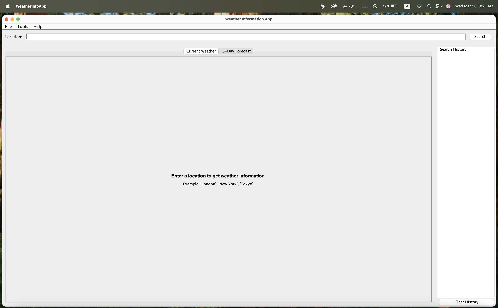
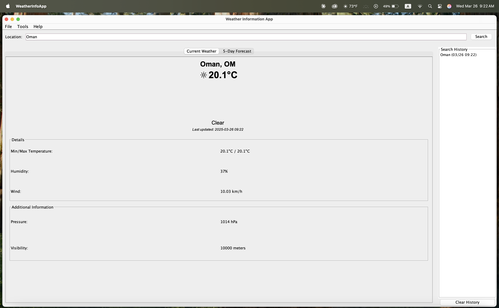
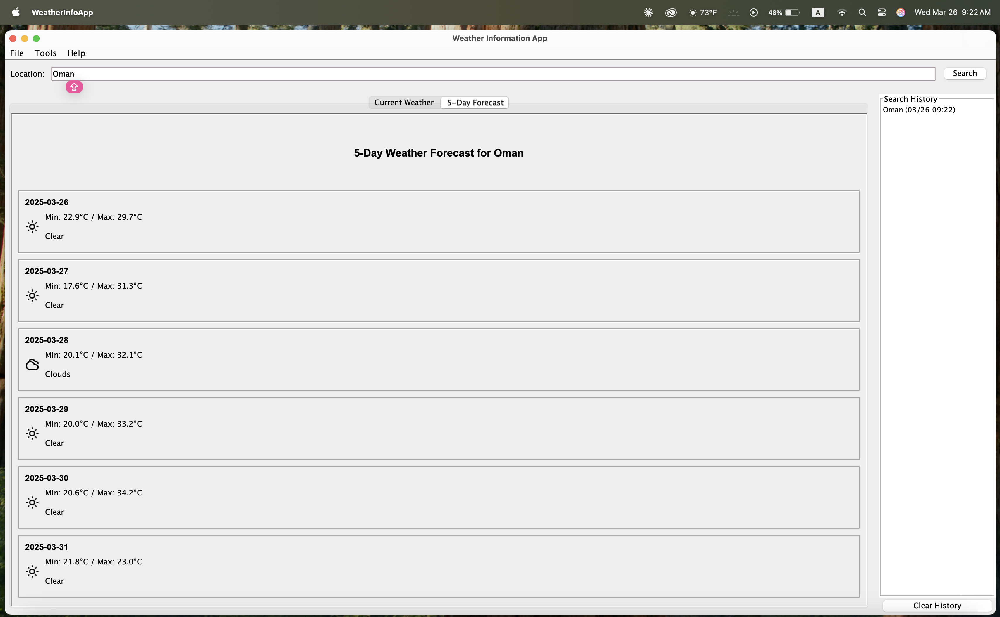
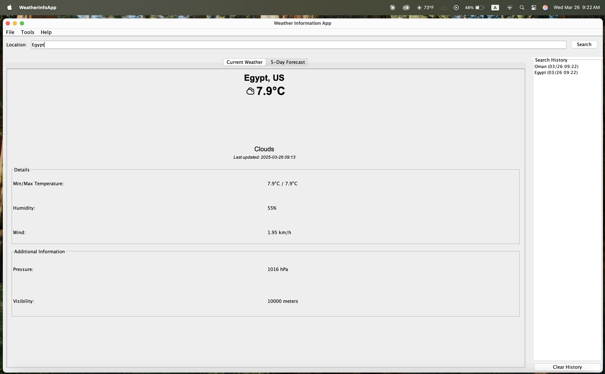
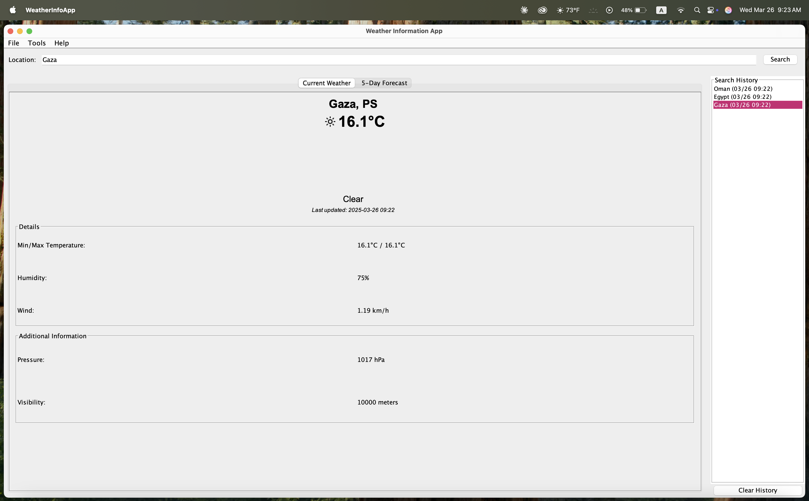
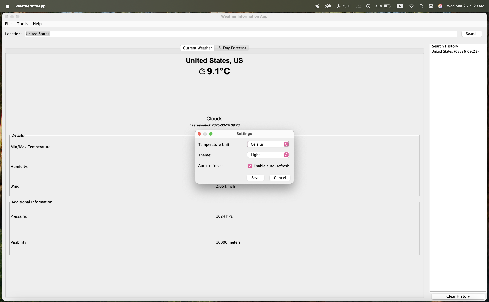
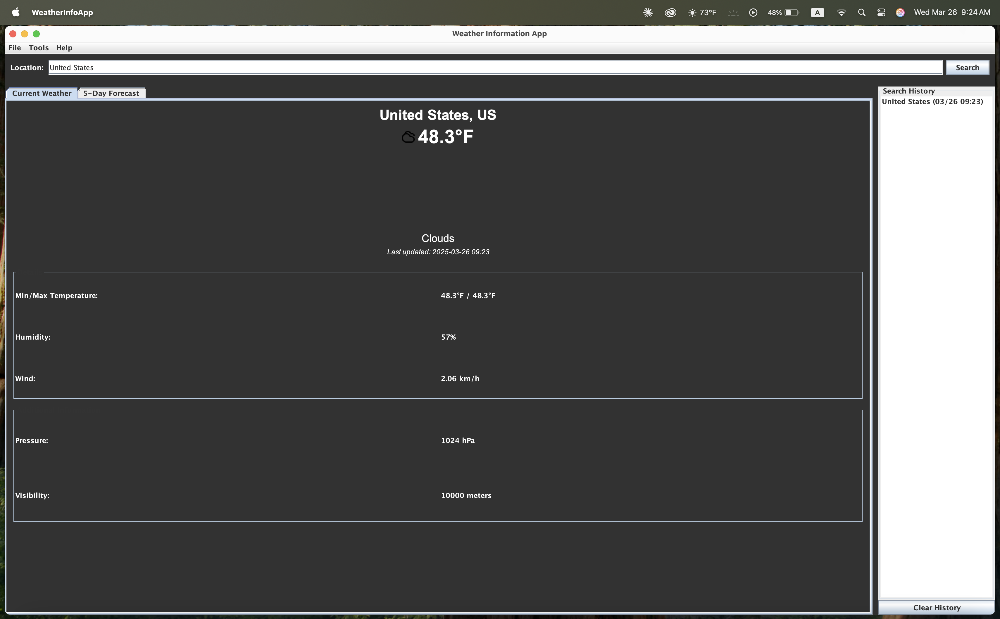

# Weather Information Application

A comprehensive Java desktop application that provides current weather information and forecasts for locations worldwide using the OpenWeatherMap API.

## Table of Contents

- [Weather Information Application](#weather-information-application)
  - [Table of Contents](#table-of-contents)
  - [Features](#features)
  - [Project Structure](#project-structure)
  - [Requirements](#requirements)
  - [Setup Instructions](#setup-instructions)
    - [1. Clone or Download the Repository](#1-clone-or-download-the-repository)
    - [2. Ensure Required Libraries are Present](#2-ensure-required-libraries-are-present)
    - [3. Add Weather Icons](#3-add-weather-icons)
    - [4. Build and Run](#4-build-and-run)
  - [Usage Guide](#usage-guide)
  - [API Integration](#api-integration)
  - [Customization](#customization)
    - [Adding New Weather Icons](#adding-new-weather-icons)
    - [Supporting Additional Weather APIs](#supporting-additional-weather-apis)
    - [Changing the Look and Feel](#changing-the-look-and-feel)
  - [Troubleshooting](#troubleshooting)
    - [Common Issues](#common-issues)
  - [Screenshots](#screenshots)

## Features

- **Current Weather Data**: Display of temperature, humidity, wind speed, pressure, and more
- **5-Day Weather Forecast**: Daily temperature ranges and conditions
- **Search History**: View and recall previous weather lookups
- **Customizable Settings**: Choose between Celsius and Fahrenheit, select theme
- **Auto-Refresh**: Option to automatically update weather data at regular intervals
- **Responsive UI**: Clean and intuitive user interface built with Java Swing

## Project Structure

```
├── src/                        # Source code directory
│   ├── main/
│   │   ├── java/
│   │   │   ├── WeatherInfoApp.java     # Main application class
│   │   │   ├── WeatherData.java        # Current weather data model
│   │   │   ├── WeatherForecast.java    # Forecast data model
│   │   │   ├── WeatherHistory.java     # History management
│   │   │   ├── WeatherIconManager.java # Icon handling
│   │   │   ├── WeatherApiClient.java   # API communication
│   │   │   ├── AppSettings.java        # Settings management
│   │   │   └── SettingsDialog.java     # Settings UI
│   ├── resources/              # Resources directory
│   │   ├── icons/              # Weather icons
│   │   │   ├── sunny.png
│   │   │   ├── cloudy.png
│   │   │   ├── rainy.png
│   │   │   ├── snow.png
│   │   │   ├── thunderstorm.png
│   │   │   ├── foggy.png
│   │   │   └── unknown.png
├── lib/                        # External libraries
│   ├── json-simple-1.1.1.jar   # JSON parsing library
├── build.xml                   # Ant build file
```

## Requirements

- Java JDK 8 or higher
- Apache Ant (for building with build.xml)
- External libraries (included in /lib directory)
- Internet connection to fetch weather data

## Setup Instructions

### 1. Clone or Download the Repository

```bash
git clone <repository-url>
cd weather-information-app
```

### 2. Ensure Required Libraries are Present

Make sure the JSON Simple library is in the lib directory:

```bash
mkdir -p lib
# Download the JSON Simple library
curl -L https://repo1.maven.org/maven2/com/googlecode/json-simple/json-simple/1.1.1/json-simple-1.1.1.jar -o lib/json-simple-1.1.1.jar
```

### 3. Add Weather Icons

Create icons directory and add weather icons:

```bash
mkdir -p src/resources/icons
# Add your weather icons to this directory
# Required icons: sunny.png, cloudy.png, rainy.png, snow.png,
# thunderstorm.png, foggy.png, unknown.png
```

### 4. Build and Run

Using Apache Ant:

```bash
# Install Apache Ant if needed
# macOS: brew install ant
# Ubuntu/Debian: sudo apt-get install ant
# Windows: download from https://ant.apache.org/bindownload.cgi

# Build and run the application
ant run
```

Manually (without Ant):

```bash
# Create build directory
mkdir -p build

# Compile the source files
javac -d build -cp "lib/*" src/main/java/*.java

# Copy resources to build directory
cp -r src/resources build/

# Run the application
java -cp "build:lib/*" WeatherInfoApp  # On Windows use ; instead of :
```

## Usage Guide

1. **Search for Weather**: Enter a city name in the search box and click "Search" or press Enter
2. **View Current Weather**: The current weather conditions will be displayed in the main panel
3. **View Forecast**: Click on the "5-Day Forecast" tab to see the weather forecast
4. **Access History**: Double-click on a location in the history list to reload that location's weather
5. **Change Settings**: Go to Tools -> Settings to change temperature units, theme, or auto-refresh settings
6. **Refresh Data**: Click Tools -> Refresh to manually update the current weather data

## API Integration

This application uses the OpenWeatherMap API to fetch weather data. The default API key is included, but it's recommended to get your own API key:

1. Sign up for a free account at [OpenWeatherMap](https://openweathermap.org/appid)
2. Get your API key from your account page
3. Replace the API_KEY value in WeatherApiClient.java with your own key

```java
private static final String API_KEY = "your_api_key_here";
```

## Customization

### Adding New Weather Icons

Add your custom icons to the `src/resources/icons` directory with appropriate names (e.g., `sunny.png`, `rainy.png`).

### Supporting Additional Weather APIs

To integrate with a different weather API:

1. Modify the `WeatherApiClient.java` class to work with the new API endpoints
2. Update the JSON parsing in `WeatherData.java` and `WeatherForecast.java` classes

### Changing the Look and Feel

The application uses the system look and feel by default. To change it:

```java
// In the main method of WeatherInfoApp.java
try {
    // Use a different look and feel
    UIManager.setLookAndFeel("com.sun.java.swing.plaf.nimbus.NimbusLookAndFeel");
} catch (Exception e) {
    e.printStackTrace();
}
```

## Troubleshooting

### Common Issues

1. **Application Won't Start**

   - Make sure Java is installed: `java -version`
   - Verify the classpath includes the JSON library

2. **No Weather Data Displayed**

   - Check your internet connection
   - Verify the API key is valid
   - Try using the mock data option for testing

3. **Icons Not Showing**

   - Ensure the icons are in the correct directory
   - Check the icon filenames match those in the code

4. **Compilation Errors**
   - Make sure all source files are present
   - Verify the JSON library is in the lib directory
   - Check for correct package statements in each file

## Screenshots








